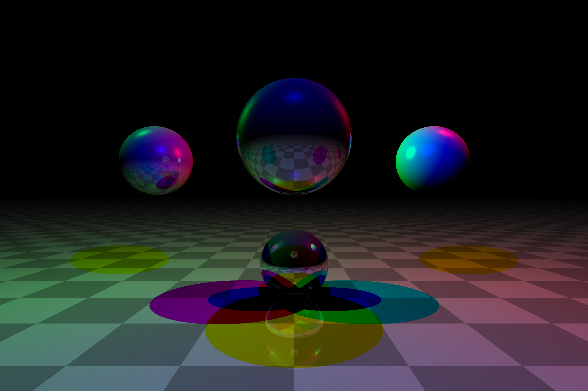
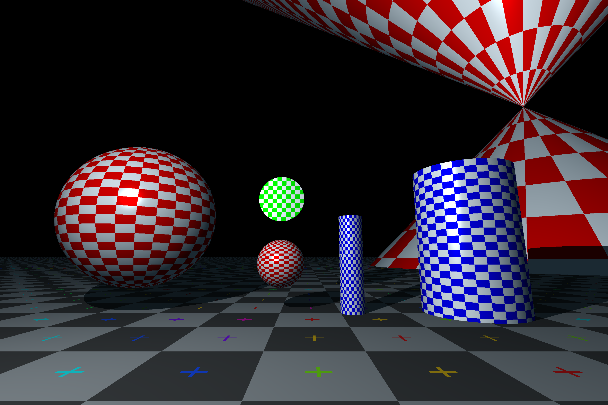
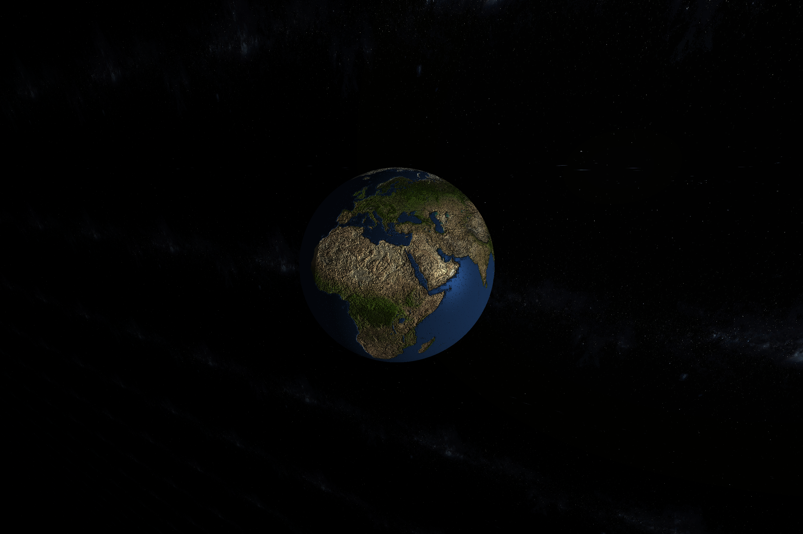
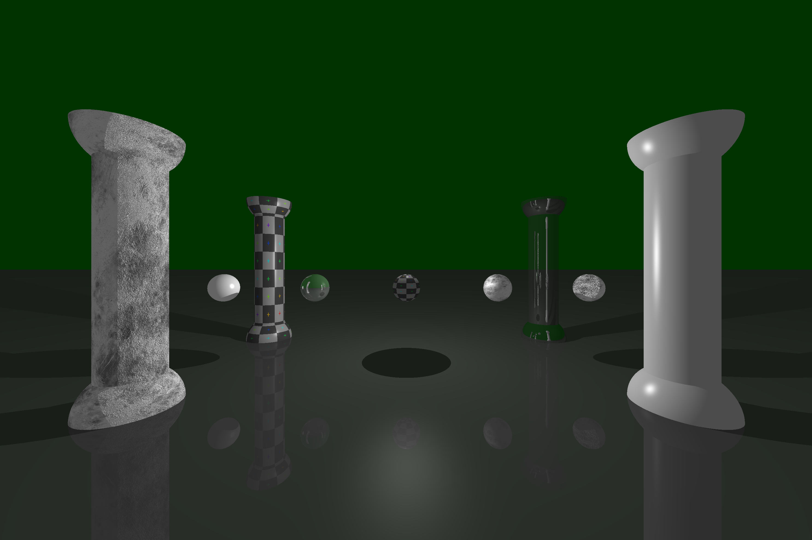

<!-- filepath: /home/sdemey/Desktop/miniRT/README.md -->
*This project has been created as part of the 42 curriculum by mmichele and sdemey.*

# miniRT

A minimal ray tracer built in C as part of the 42 School curriculum. This project renders 3D scenes using ray tracing techniques, supporting basic geometric shapes, lighting, and textures with camera controls.

   

---

## Table of Contents

- [Description](#description)
- [Rendering Showcase](#rendering-showcase)
- [Installation](#installation)
- [Compile-Time Options](#compile-time-options)
- [Quick Start](#quick-start)
- [Usage](#usage)
- [Controls](#controls)
- [Scene File Format](#scene-file-format)
- [Project Structure](#project-structure)
- [Resources](#resources)
- [License](#license)
- [Acknowledgments](#acknowledgments)

---

## Description

**miniRT** is a minimal ray tracer written in **C** as part of the graphics curriculum at **42 School**.
The objective of the project is to implement the fundamental concepts of ray tracing while working within the constraints of low-level graphics programming.

The program renders simple 3D scenes described in a `.rt` file using ray–object intersection algorithms and basic lighting models. The implementation focuses on clarity, mathematical correctness, and modular design.

During the development of this project, we explored several core topics in computer graphics, including:

* Ray casting and intersection algorithms
* Surface shading and lighting models
* Scene parsing and validation
* Mathematical transformations in 3D space

The project was built using **MiniLibX**, the lightweight graphical library used throughout the 42 curriculum.

Our objective was to design a clean and extensible rendering pipeline while keeping the implementation minimal and maintainable. Alongside the core ray tracing functionality, we introduced several features aimed at improving the overall user experience, including camera controls (with controller support), image export capabilities, texture mapping using XPM files, along with several rendering options.

This project served as an introduction to the fundamentals of graphics engine development, and as a stepping stone toward building a more advanced ray tracer in C++ in the future.

### Features

| Category | Description |
|----------|-------------|
| **Ray Tracing Engine** | Realistic 3D rendering with ray-object intersection calculations |
| **Geometric Primitives** | Spheres, planes, cylinders, cones |
| **Lighting System** | Ambient, point, reflection, colored, and multi-spot lights |
| **Checkerboard pattern** | Procedural checkerboard pattern |
| **Textures & Bump Mapping** | Surface detail support using XPM files |
| **Camera Controls** | Interactive scene navigation |
| **Export** | Save rendered images to file |
| **Scene Parsing** | Load scenes from `.rt` configuration files |

### Tech Stack

| Technology | Purpose |
|------------|---------|
| **C** | Core language |
| **MiniLibX (mlx)** | Graphics library for window management and rendering |
| **libft** | Custom C utility library |
| **Make** | Build automation |

---

## Rendering Showcase

Below are several scenes rendered with **miniRT** demonstrating lighting, reflections, textures, and bump mapping.

### Lighting



Mirror-like reflections between objects using recursive ray tracing and multiple colored spot lights.

---

### Objects



Various geometric primitives demonstrating procedural checkerboard patterns.

---

### Bump Mapping



Surface detail simulated using bump maps and textures.

---

### Overview



Complex scene combining cylinders and spheres with optional material parameters.

---

## Installation

### Prerequisites

- Linux-based system
- GCC compiler
- Make
- X11 development libraries

### Build
The project is compiled with **GCC** and the standard C flags: **-Wall -Wextra -Werror**
```sh
# Clone the repository
git clone https://github.com/your-username/miniRT.git
cd miniRT

# Compile the project
make
```

```sh
# Cleaning
make clean    # Remove object files
make fclean   # Remove object files and executable
make re       # Rebuild from scratch
```
## Compile-Time Options

Several parameters of the renderer can be configured at compilation time using preprocessor definitions.
These values can be overridden when invoking `make`.

```bash
FLAGS = -Wall -Wextra -Werror -g \
        -D WIDTH=$(W) \
        -D HEIGHT=$(H) \
        -D MAX_OBJS=$(M) \
        -D VERBOSE=$(V) \
        -D START_RENDER=$(S)
```

### Available Options

| Macro          | Description                                  | Example       |
| -------------- | -------------------------------------------- | ------------- |
| `WIDTH`        | Window width of the render viewport          | `make W=1920` |
| `HEIGHT`       | Window height of the render viewport         | `make H=1080` |
| `MAX_OBJS`     | Maximum number of objects allowed in a scene | `make M=200`  |
| `VERBOSE`      | Enable verbose debug output                  | `make V=1`    |
| `START_RENDER` | Automatically render the scene at startup    | `make S=1`    |

### Example

Compile the renderer with a custom resolution and verbose output:

```bash
make W=1920 H=1080 V=1
```

This will override the default values defined in the `Makefile`.

---

## Quick Start

```bash
git clone https://github.com/your-username/miniRT.git
cd miniRT
make
./miniRT static/example.rt
```

## Usage

```bash
./miniRT <scene_file.rt>
```


## Controls

| Key | Action |
|----|----|
| ESC              | Quit |
| p, [,]            | Full render |
| e                | Export |
| w, a, s, d, SPACE, c  | Movements |
| z                | Skip to controller input |
| Mouse-Right      | Color picker and visualizer |
| i, j, k, l          | Orientation |
| -, =              | FOV |
| e, Mouse-Left     | Take or release, control of object |
| x                | Toggle reticle |
| i, j, k, l, u, o      | Orientation |
| t, g              | Radius |
| y, h              | Height |


Click on an object to take control of it.
Controller support is also available.

---

## Scene File Format

Scene files use the `.rt` extension and define objects, lights, and camera settings:

```
A  0.2  255,255,255                        # Ambient light (ratio, color)
C  0,0,-100  0,0,1  70                     # Camera (position, orientation, FOV)
L  -40,50,0  0.6  255,255,255              # Light (position, brightness, color)

sp 0,0,20    20    255,0,0                 # Sphere (center, diameter, color)
pl 0,0,-10   0,1,0  0,0,255                # Plane (point, normal, color)
cy 50,0,20   0,0,1  14  21  10,0,255       # Cylinder (center, axis, diameter, height, color)
```

### Material Options (Optional Parameters)

The project supports extended material properties including specular highlights, reflections, textures, and bump mapping.
These properties can be added as optional parameters to object definitions.

Example:

```
sp 0.00,0.00,0.00 10.00 255,0,0 s=44 r=0.0 b=tex x=static/textures/earth_col.xpm
cy -15.00,0.00,0.00 0.0420,-0.9971,0.0634 5.99 12.00 0,0,255 s=32 r=0.0 c=0 x=static/textures/cola.xpm b=static/textures/droplets.xpm
```

### Supported Parameters

| Parameter | Description                                                 |
| --------- | ----------------------------------------------------------- |
| `s`       | **Shininess** value used for specular highlights            |
| `r`       | **Reflection coefficient** controlling surface reflectivity |
| `x`       | **Texture map** using an XPM image file                     |
| `b`       | **Bump map** used to simulate surface detail                |
| `c`       | **Checkerboard pattern** applied procedurally               |

### Bump Mapping Options

The bump parameter supports multiple modes:

| Syntax         | Description                             |
| -------------- | --------------------------------------- |
| `b=tex`        | Use the same file as the texture map    |
| `b=<file>.xpm` | Use a separate bump map file            |
| `b=1`          | Enable a generic procedural bump effect |

### Example

```
sp 0,0,20 20 255,0,0 s=32 r=0.3 x=textures/earth.xpm b=tex
```

This creates a sphere with:

* specular highlights
* reflective surface
* a texture map
* a bump map derived from the texture


---
## Project Structure

```
miniRT/
├── doc/           		# Math documentation
├── includes/           # Header files
│   ├── minirt.h        # Main header
│   ├── structs.h       # Object structures
│   ├── parsing.h       # Scene parsing declarations
│   └── ...
├── src/
│   ├── events /        # Input handling and camera controls
│   ├── export /        # Export scene (in .rt)
│   ├── graphics/       # Ray tracing core
│   ├── maths/          # Helper math functions
│   ├── parsing/        # Scene file parser
│   └── main.c          # Entry point
├── libs/
│   ├── libft/          # Custom C library
│   └── mlx/            # MiniLibX graphics library
├── static/             # Example scene files (.rt) and textures images (XPM)
├── Makefile
└── README.md
```
## Rendering Pipeline

The rendering process follows these steps:

1. Parse the `.rt` scene file
2. Initialize camera, lights, and objects
3. Cast rays from the camera through each pixel
4. Compute ray–object intersections
5. Apply lighting calculations
6. Render the final image to the window
---

## Resources

| Topic | Links |
|-------|-------|

### AI Usage

AI tools were used exclusively for documentation assistance:
- Review documentation structure and clarity
- Assist with technical explanations
- Improve wording and organization of the README

---

## License

This project is part of the 42 School curriculum and is 42 private property.

---

## Acknowledgments
- [42 School](https://42.fr/) for the project specifications


<!-- TODO :
	- Add screnshots
	- Ressources
	 -->